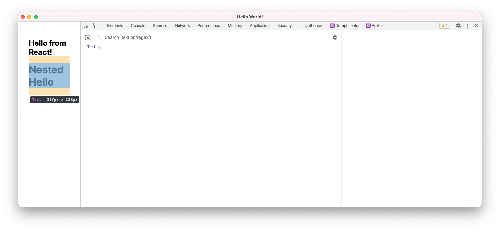
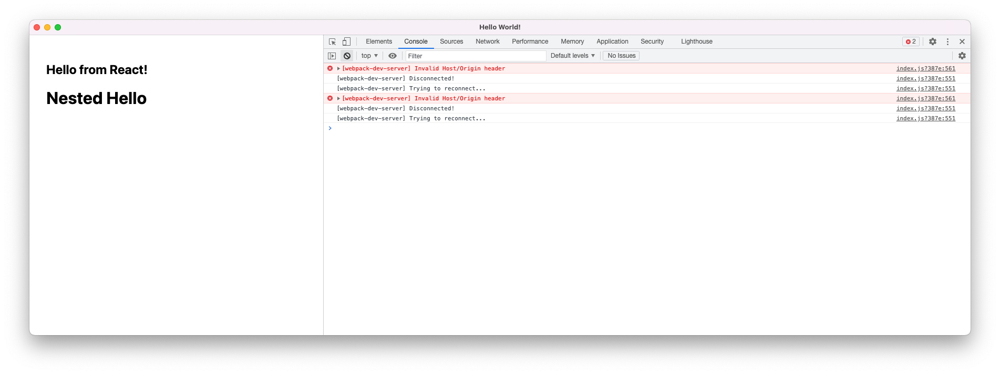
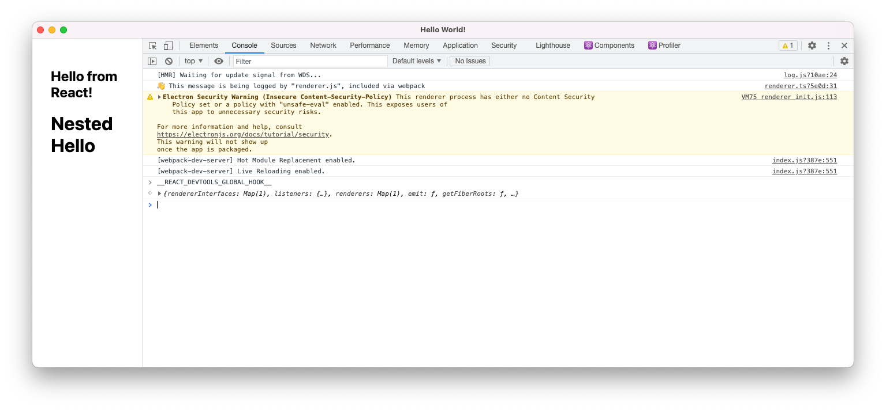
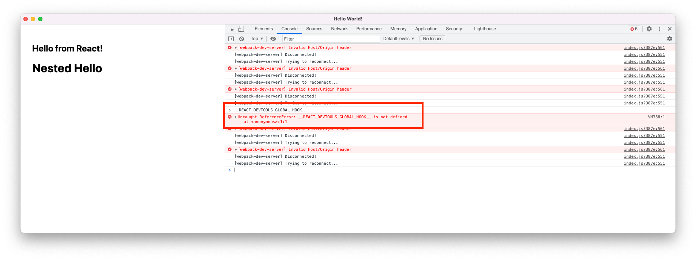
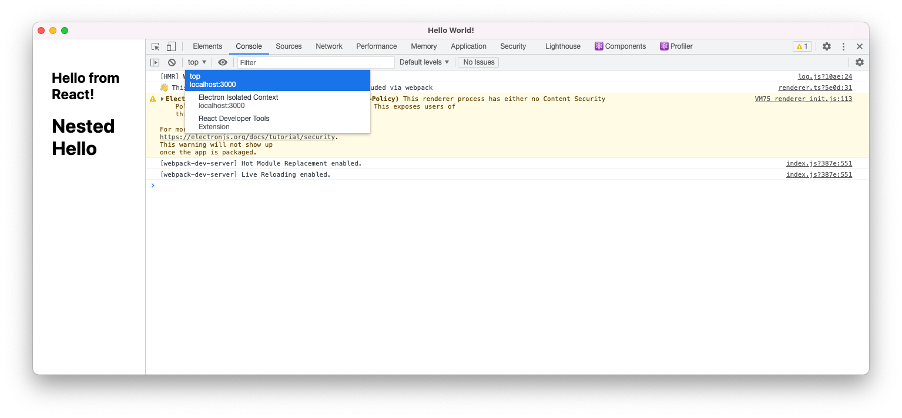
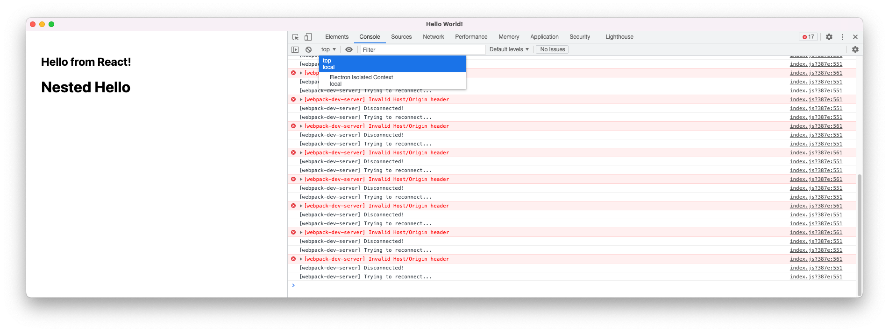

test-react-devtools
===

This is a test Electron app to demonstrate issues with using React DevTools in combination with a custom scheme.

The app can run in two different modes:

1) Loading content over http (using the Webpack dev server)



2) Loading content over a custom `local-scheme` URL



To switch between the two modes, locate and change the `TEST_LOCAL_SCHEME` constant in `src/indes.ts`

Observations:
--

### Content Scripts

React DevTools uses a contentScript to inject a `__REACT_DEVTOOLS_GLOBAL_HOOKS__` variable.



When using a local scheme that variable isn't injected, which implies that the content script isn't running



### Background Scripts

React DevTools uses a background script to do some additional coordination (I haven't dug into the details). I *think* this shows up in devtools as an additional context in the Console.



However, under the custom scheme that script doesn't appear to be loaded



Running App
---

```
yarn install
yarn start

# change TEST_LOCAL_SCHEME value to test other setup...

yarn start
```
